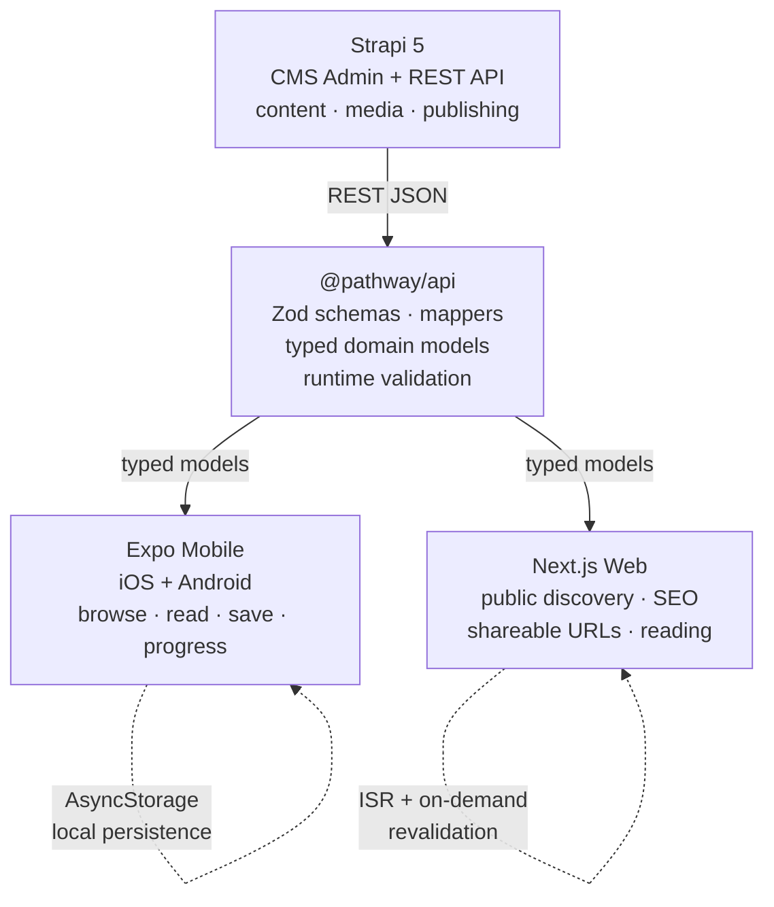

# Pathway

A CMS-driven professional learning platform built as a portfolio proof project. Strapi manages structured content and publishing, an Expo app delivers the iOS and Android learning experience, and a Next.js website provides public discovery, SEO, and shareable lesson URLs.

> **Status:** Portfolio proof project — production-minded, not in production. Local demo ready; deployment in progress.

| | |
| --- | --- |
| **Language** | TypeScript (strict, no `any` at the API boundary) |
| **Mobile** | Expo Router (React Native) — iOS + Android |
| **Web** | Next.js 16 App Router — public discovery, SEO, reading |
| **CMS** | Strapi 5 — content, media, publishing, REST API |
| **Shared** | `@pathway/api` (Zod schemas + mappers), `@pathway/ui-tokens` |
| **Styling** | StyleX (web), shared design tokens (mobile + web) |
| **Tests** | `node:test` — 68 via `pnpm test` + 70 web lib tests |
| **CI** | GitHub Actions — lint, typecheck, test on every PR |
| **Monorepo** | pnpm workspaces |

[CI status — coming soon]

## Overview

Pathway is a content-driven learning platform with three surfaces that share one content source of truth. A Strapi CMS holds learning paths, modules, lessons, authors, and categories. An Expo mobile app lets a learner browse, read, save, and track progress locally. A Next.js website publishes stable, shareable URLs for paths and lessons with SEO metadata, Open Graph tags, and editorial reading layouts.

This is not a startup, a product in production, or an LMS. It is a portfolio proof project built to demonstrate how a senior engineer structures a cross-platform, content-driven product: a single CMS feeding two distinct client surfaces through a shared, typed, runtime-validated API boundary.

The content is real and seeded — four learning paths (React Native Performance, Production Mobile Engineering, Accessible Product Design, AI Tools for Product Teams) with modules and lessons — but the product is intentionally scoped to what one engineer can build, test, and explain clearly.

## Why I built this

I built Pathway to show my approach to full-stack, cross-platform architecture without hiding behind a single framework. Most portfolio projects pick one surface (a mobile app, or a web app, or an API). Pathway picks all three and forces the hard question: how do you keep content, types, and rendering concerns honest when two very different clients consume the same data?

The answer this project demonstrates: one CMS as the source of truth, one shared package that validates and maps CMS data into typed domain models, and two clients that never touch raw CMS payloads. No `any`. No hardcoded content. No duplicated mappers. Runtime validation at the boundary, not scattered through the UI.

## Architecture



**Strapi owns content, media, publishing, the CMS admin, and the REST API.** It is the single source of truth. Public clients only ever see published content. The project does not rebuild the Strapi admin anywhere else.

**Expo owns the native mobile learning experience** — browsing, reading, saving, and tracking progress. It consumes published content through `@pathway/api` and persists saved items and progress locally via AsyncStorage.

**Next.js owns public discovery, SEO, direct lesson URLs, and editorial reading layouts.** It is a read-only public client of the CMS, with ISR (revalidate every 5 minutes) and an on-demand revalidation webhook for immediate content updates.

**There is intentionally no custom CMS dashboard in Next.js.** Strapi already ships a complete admin UI. Rebuilding it would duplicate the CMS and weaken the architecture story.

See [`docs/architecture.md`](docs/architecture.md) for the full three-surface split rationale.

## Tech Stack

| Area | Stack |
| --- | --- |
| **Mobile** | Expo Router, React Native 0.86, React 19, AsyncStorage, expo-image, expo-symbols, expo-web-browser, react-native-reanimated, react-native-safe-area-context |
| **Web** | Next.js 16 (App Router, Turbopack), React 19, StyleX, ISR + on-demand revalidation, dynamic sitemap + robots |
| **CMS** | Strapi 5, SQLite (local), REST API, media management, draft/published publishing |
| **Shared packages** | `@pathway/api` — Zod v4 schemas, Strapi response mappers, typed domain models, fetch client. `@pathway/ui-tokens` — color, spacing, typography, borders, shadows, radii |
| **Quality / tooling** | TypeScript (strict), pnpm workspaces, `node:test`, ESLint, GitHub Actions CI, StyleX (web) |

## Product Features

### Mobile app (Expo)

- **Home** — greeting, continue-learning card, featured paths, recommended lessons, recently saved.
- **Explore** — all published paths with client-side search and topic filters; no-results state with reset.
- **Learning path detail** — hero with cover/metadata/progress/contextual CTA, module accordions with completion summary, lesson rows with status indicators (icon + text, never color alone).
- **Lesson detail** — context breadcrumb, metadata tags, media preview/fallback, body renderer, key takeaway, completion card, prev/next navigation.
- **Saved content** — persisted lessons and paths via AsyncStorage; segmented control; unavailable content shows a discrete notice without deleting slugs.
- **Local persistence** — save/remove lessons, mark complete/incomplete, path save — all survive app restart.
- **States** — loading skeletons, error with retry, empty, no-results, and unavailable states across every screen.

### Public web (Next.js)

- **Homepage** — hero + real content sections (featured paths, popular lessons, topics, practical learning); sections omitted gracefully when the CMS is empty.
- **Explore** — search + topic/difficulty filters + result grid; URL sync debounced; no-results state with clear-filters.
- **Learning path route** (`/paths/[slug]`) — hero + curriculum + sticky summary + related paths; `notFound()` for missing/unpublished.
- **Lesson route** (`/lessons/[slug]`) — hero + media + table of contents + article body + share + prev/next nav + parent CTA + related lessons; `notFound()` for missing/unpublished.
- **SEO** — per-route metadata, Open Graph tags, canonical URLs, dynamic `sitemap.xml` and `robots.txt` reflecting published content.
- **Responsive reading layout** — keyboard navigation, visible focus rings, `prefers-reduced-motion` respected, 404 pages carry `noindex`.

### CMS (Strapi)

- **Learning paths** — with cover, summary, difficulty, estimated time, and module ordering.
- **Modules** — group lessons within a path, with ordering.
- **Lessons** — Markdown body, media, key takeaway, reading time, prev/next ordering.
- **Authors and categories** — author profiles and topic categorization.
- **Published content as source of truth** — draft/published state with `publishedAt`; public clients only see published content.
- **Seed script** — `pnpm --filter @pathway/cms seed:pathway` creates 4 paths, 12 modules, 36 lessons, 4 categories, 1 author, and configures public read permissions.

## What this demonstrates

- **Cross-platform product architecture** — one content model feeding a native app and a public website with different rendering needs.
- **CMS-to-client data flow** — Strapi REST → shared package → typed models → UI, with no raw CMS payloads in components.
- **Typed API boundary** — `@pathway/api` exposes typed domain models; clients never cast or guess.
- **Runtime validation** — Zod schemas validate every external CMS response at the boundary, not in the UI.
- **Reusable visual system** — shared `@pathway/ui-tokens` + StyleX on web; same color, spacing, typography, and border values across surfaces.
- **Local persistence** — AsyncStorage on mobile with a tested reducer guarding save/remove/complete/incomplete flows.
- **SEO and public web responsibility** — ISR, on-demand revalidation webhook, dynamic sitemap/robots, OG metadata, canonical URLs, `noindex` on 404s.
- **CI quality gates** — GitHub Actions runs lint, typecheck, and test on every PR and push to `main`; frozen lockfile; no secrets.
- **Honest scope control** — no auth, no payments, no sync, no custom CMS dashboard, no V2 features. Limitations are documented, not hidden.

## Project Structure

```text
pathway/
├── apps/
│   ├── mobile/              # @pathway/mobile — Expo Router app (iOS + Android)
│   ├── web/                 # @pathway/web — Next.js App Router public website
│   └── cms/                 # @pathway/cms — Strapi 5 CMS and REST API
├── packages/
│   ├── api/                 # @pathway/api — Zod schemas, mappers, typed models, fetch client
│   └── ui-tokens/           # @pathway/ui-tokens — shared visual tokens
├── docs/
│   ├── architecture.md      # three-surface split rationale
│   ├── cms-seeding.md       # reset-and-seed workflow
│   ├── decisions/           # 6 ADRs + visual-system, accessibility, testing docs
│   └── milestones/          # M1–M5 milestone definitions and reviews
├── .github/workflows/       # CI (lint, typecheck, test)
├── package.json             # root workspace scripts
└── pnpm-workspace.yaml
```

## Running Locally

### Prerequisites

- **Node.js 22** (LTS)
- **pnpm 11.8.0** (pinned via `packageManager`)

```bash
corepack enable
corepack prepare pnpm@11.8.0 --activate
```

### Install

```bash
pnpm install
```

### Environment setup

Copy the env examples and adjust if needed (defaults work for local dev):

```bash
cp apps/web/.env.example   apps/web/.env.local
cp apps/cms/.env.example   apps/cms/.env
cp apps/mobile/.env.example apps/mobile/.env
```

### Seed the CMS (first run)

Start the CMS, create an admin account at http://localhost:1337/admin, then seed content:

```bash
pnpm dev:cms                                # http://localhost:1337/admin
pnpm --filter @pathway/cms seed:pathway     # in another terminal
```

This creates 4 learning paths, 12 modules, 36 lessons, 4 categories, 1 author, and configures public read permissions. See [`docs/cms-seeding.md`](docs/cms-seeding.md) for the full reset-and-seed workflow.

### Run the apps

Each app runs in its own terminal:

| App | Command | URL / notes |
| --- | --- | --- |
| CMS | `pnpm dev:cms` | http://localhost:1337 (Strapi admin) |
| Web | `pnpm dev:web` | http://localhost:3000 |
| Mobile | `pnpm dev:mobile` | Expo dev server; press `i` (iOS) or `a` (Android) |
| Mobile (iOS) | `pnpm dev:mobile:ios` | iOS simulator |
| Mobile (Android) | `pnpm dev:mobile:android` | Android emulator |

> **Physical device:** `EXPO_PUBLIC_STRAPI_URL` in `apps/mobile/.env` must point to your machine's local network IP (e.g. `192.168.x.x:1337`), not `localhost`.

### Quality checks

| Check | Command |
| --- | --- |
| Lint (all) | `pnpm lint` |
| Typecheck (all) | `pnpm typecheck` |
| Test (API + mobile) | `pnpm test` |
| Web build | `pnpm --filter @pathway/web build` |
| Web typecheck only | `pnpm --filter @pathway/web exec tsc --noEmit` |
| Mobile typecheck only | `pnpm --filter @pathway/mobile exec tsc --noEmit` |

## Environment Variables

| Variable | Where | Purpose |
| --- | --- | --- |
| `STRAPI_URL` | `apps/web/.env.local` | Strapi CMS base URL (server-side only) |
| `NEXT_PUBLIC_SITE_URL` | `apps/web/.env.local` | Public site origin for canonical URLs, OG, sitemap, robots |
| `REVALIDATE_SECRET` | `apps/web/.env.local` | Authenticates the on-demand revalidation webhook |
| `EXPO_PUBLIC_STRAPI_URL` | `apps/mobile/.env` | Strapi CMS URL bundled into the mobile app |
| `HOST`, `PORT` | `apps/cms/.env` | Strapi host and port |
| `APP_KEYS`, `API_TOKEN_SALT`, `ADMIN_JWT_SECRET`, `TRANSFER_TOKEN_SALT`, `JWT_SECRET`, `ENCRYPTION_KEY` | `apps/cms/.env` | Strapi secrets (generate strong values for any non-local use) |

See the `.env.example` files in each app for full comments and defaults.

## Deployment

> **Current state:** The project runs fully locally. Deployment is in progress as part of Milestone 5.

- **Web deployment** — [Live Web Demo — coming soon]. Target: Vercel (zero-config Next.js). The web build survives a CMS outage — it deploys with empty/fallback states and serves real content once `STRAPI_URL` points to a reachable Strapi.
- **CMS deployment** — [coming soon]. Target: Railway (preferred) or Render with Postgres and persistent upload storage. The seed script runs after first deploy to create content.
- **Mobile preview** — Expo Go (local). The mobile app runs via Expo Go or iOS/Android simulator — no EAS build or App Store publish required. All native dependencies are Expo Go compatible. See [`docs/mobile-preview.md`](docs/mobile-preview.md) for the full guide.

Until deployment is live, the full experience is reproducible locally with the commands above. See [`docs/deployment.md`](docs/deployment.md) for the full deployment guide: Vercel settings, CMS hosting options, env vars, smoke test checklist, and rollback notes.

## Screenshots and Demo

> [Screenshots — coming soon]

| Screen | Surface |
| --- | --- |
| Home | Mobile |
| Explore (search "FlashList") | Mobile |
| Learning Path (React Native Performance) | Mobile |
| Lesson (Optimizing Long Lists with FlashList) | Mobile |
| Saved | Mobile |
| Homepage | Web |
| Learning Path | Web |
| Lesson (TOC + article body) | Web |
| Strapi Admin (Content Manager) | CMS |
| Architecture diagram | Diagram |

> [Demo Video — coming soon] — a 60–90 second walkthrough: mobile flow → web flow → Strapi edit → revalidation.

## Technical Decisions

| Decision | Rationale | Reference |
| --- | --- | --- |
| **Strapi as content source of truth** | One CMS owns content, media, and publishing. No duplicated content between mobile and web. | [ADR-001](docs/decisions/ADR-001-strapi-content-source-of-truth.md) |
| **Shared typed API boundary** | Both clients validate external CMS data once, at the boundary, with Zod. No `any` in UI. | [ADR-002](docs/decisions/ADR-002-shared-api-boundary.md) |
| **Local persistence for V1** | AsyncStorage on mobile; no backend accounts or sync. Honest scope for a portfolio project. | [ADR-003](docs/decisions/ADR-003-local-persistence-strategy.md) |
| **ISR + on-demand revalidation** | Web pages revalidate every 5 minutes; a webhook triggers immediate updates on Strapi publish. | [ADR-004](docs/decisions/ADR-004-on-demand-revalidation.md) |
| **Public content unavailable policy** | Unpublished/missing content returns `null` → `notFound()`, never a crash or empty shell. | [ADR-005](docs/decisions/ADR-005-public-content-unavailable-policy.md) |
| **Public route and metadata convention** | Stable slugs, per-route metadata, OG tags, canonical URLs, `noindex` on 404s. | [ADR-006](docs/decisions/ADR-006-public-route-and-metadata-convention.md) |
| **No custom CMS dashboard** | Strapi ships a full admin. Rebuilding it in Next.js would duplicate the CMS. | [`docs/architecture.md`](docs/architecture.md) |
| **Shared visual system** | One set of tokens (color, spacing, typography, borders, shadows) consumed by both surfaces. | [`docs/decisions/visual-system.md`](docs/decisions/visual-system.md) |
| **Accessibility and states** | ARIA labels, touch targets ≥44px, visible focus, semantic HTML, `prefers-reduced-motion`, icon + text status (never color alone). | [`docs/decisions/accessibility-and-states.md`](docs/decisions/accessibility-and-states.md) |
| **Testing and CI** | `node:test` (no test framework dependency), GitHub Actions for lint/typecheck/test, frozen lockfile. | [`docs/decisions/testing-and-ci.md`](docs/decisions/testing-and-ci.md) |

## Known Limitations

This is a portfolio proof project, not a production LMS. Honest constraints:

- **No authentication** — no sign-in, no user accounts. The product is a local-only demo.
- **Saved items are local-only** — AsyncStorage on mobile; no cross-device sync.
- **Progress does not sync** — lesson completion is stored on the device only.
- **No payment or enrollment flow** — content is freely browsable; no gating.
- **No custom CMS dashboard** — Strapi's admin is used directly, by design.
- **Search is basic** — client-side substring match across real text fields; no full-text search.
- **Media is thumbnail/embed** — no video player pipeline; direct video URLs render a native `<video>` (web) or a play-icon affordance (mobile).
- **No E2E tests** — validation is manual plus unit tests; no Playwright, Cypress, or Detox.
- **No coverage analysis** — `node:test` does not emit coverage reports.
- **Mobile lesson body links** — external `http(s)` links render as styled text on native; `expo-web-browser` wiring is deferred.
- **Web ToC scroll-spy** — TOC links to real anchors but does not highlight the current section.
- **Single light mode** — no dark theme planned for V1.
- **Not a full LMS** — no courses, enrollments, certificates, or instructor tools.

## What I would do next

These are honest directions, not promises:

- **Real authentication** — sign-in, user accounts, server-backed saved items and progress.
- **Backend progress sync** — replace local-only persistence with a synced store.
- **Deep links from web to app** — `pathway://paths/[slug]` so a shared web URL opens the mobile lesson.
- **EAS preview builds** — distributable iOS/Android preview builds for reviewers.
- **Deployed CMS** — Strapi on Railway or Render so the deployed web app has live content.
- **Full-text search** — server-side search over lesson content, not client-side substring.
- **Accessibility audit** — formal audit against WCAG, not just manual review.
- **Richer media pipeline** — video player, transcripts, audio narration.
- **Dark mode** — token-driven theme switching.
- **Full Product** — Maybe a full product


## Contact

- **LinkedIn** — [[Jonathan Ramalho](https://www.linkedin.com/in/jonathanramalho)]
- **Portfolio** — [[jramalho.dev](https://www.jramalho.dev/)]
- **Email** — [email me](jonathan.oliveira.ramalho@gmail.com)

---

Built with TypeScript, pnpm workspaces, Expo, Next.js, Strapi, StyleX, Zod, and `node:test`.